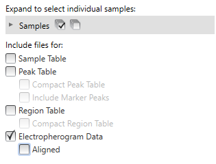
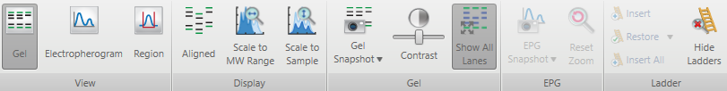
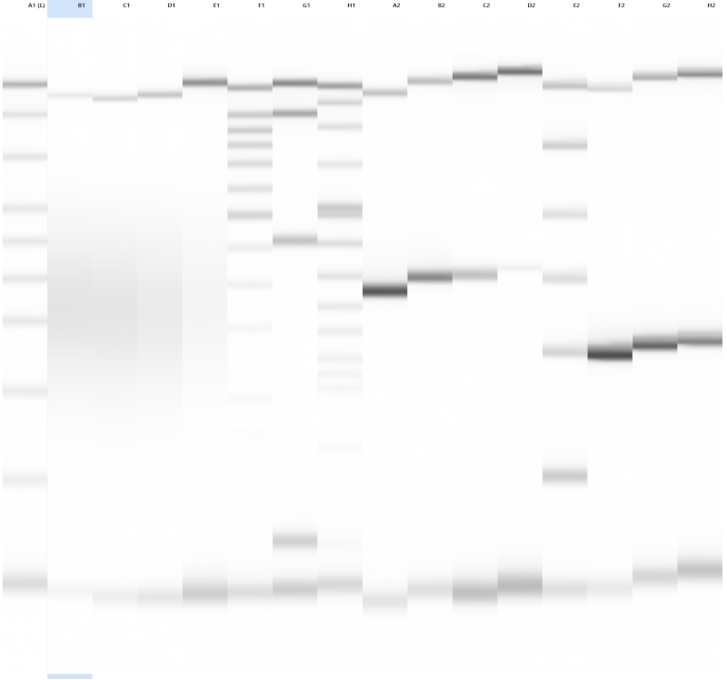
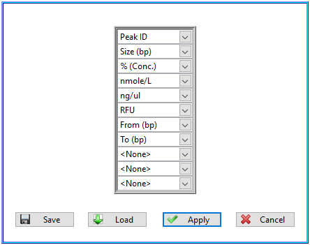
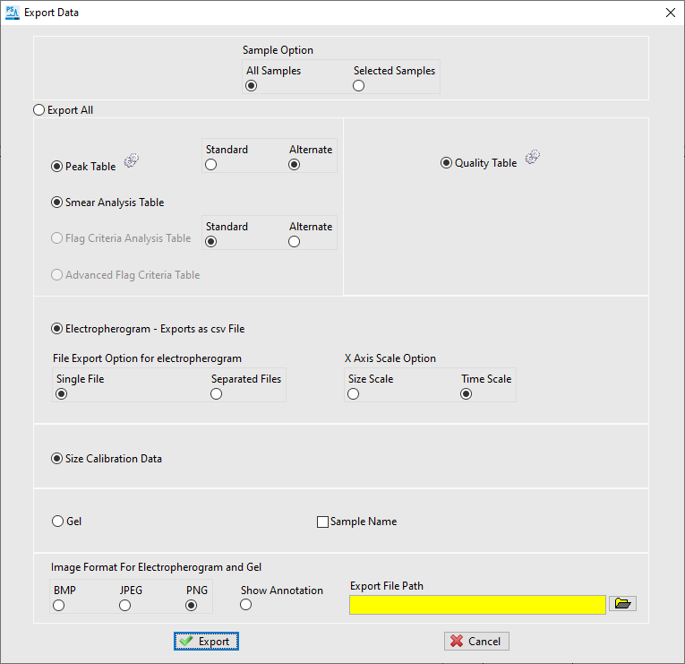

```{r, include = FALSE}
knitr::opts_chunk$set(
	collapse = TRUE,
	comment = "#>"
)
```

```{r, include = FALSE}
library(bioanalyzeR)
library(ggplot2)
library(scales)
```

# Introduction

This package imports data from Agilent automated electrophoresis systems (Bioanalyzer, TapeStation, Fragment Analyzer, ZAG DNA Analyzer, Femto Pulse) and includes functions to graph and analyze the data. To download or contribute to the package, please see [its page on GitHub](https://github.com/jwfoley/bioanalyzeR).

## Features

* Reads the output of various DNA and RNA assays into a single unified data structure, even data from multiple batches.
* Automatically estimates the molecule length, concentration, and molarity for every data point.
* Provides a simple but powerful function (based on `ggplot2`) to draw professional-quality electropherograms with any combination of variables, faceting, and aesthetics, including elegant sparklines.
* Provides functions to automatically compute and compare any variable of interest within all samples, peaks, or regions, as well as shortcuts to calculate the DV200 of fragmented RNA and the insert:dimer ratio of Illumina libraries.
* Provides a powerful command-line script to automate these analyses.

## Why is this useful?

* **More flexible and professional-looking graphs.** The graphing options in the Agilent software are limited, especially when you combine data from multiple batches. Importing the data into R, and especially graphing the data with `ggplot2`, allows you to customize the presentation in any way you can imagine.
* **Less misleading graphs.** The electropherograms from the Agilent software show only fluorescence on the y-axis. Fluorescence is proportional to mass, but often the real variable of interest is molarity: how many molecules? On a fluorescence graph, a 200 bp peak looks the same as a 100 bp peak with twice as much molarity. Or if your only interest is the size distribution within each sample and not the total amount, you can normalize them all to the same scale for easy comparison.
* **Automated analysis.** If you just want to perform a simple QC analysis like DV200 or library insert:dimer ratio, you can script that for an unlimited number of batches, or use the provided command-line script, and collect the results directly into a table.


# Exporting data from the Agilent software

## Bioanalyzer

In the 2100 Expert software, open your data file (`.xad`) in the "Data" context. Select "File->Export..." from the top menu. Check the "Export to XML" box and no others. Click "Export" and then save the file wherever you like.

## TapeStation

In the TapeStation Analysis Software, open your data file (`.D1000`, `.HSD1000`, `.RNA`., `.gDNA`, etc.). You need to export both the metadata (in XML format) and electropherogram data (CSV), or if you are using an old version of the TapeStation Analysis software (deprecated), the XML and a specially captured screenshot of the gel image.

### Metadata XML
Select "File->Export Data->Export to XML". You do not need to export the gel image or individual EPG images at this point. Select your destination and then click "Export" to save the file.

### Electropherogram CSV
Select "File->Export Data->Export to CSV". Unselect all files except "Electropherogram Data", and unselect "Aligned". The other settings do not matter but the filename must match the XML file. The software will append `_Electropherogram.csv` to the name you enter.



Exporting to CSV requires version 4.1 or higher of the [TapeStation Analysis software](https://explore.agilent.com/Software-Download-TapeStation-Systems).

### Gel image PNG (deprecated)
These instructions are required only for old versions of the TapeStation Analysis software. The data will be noisier, and it is important to follow these unusual directions carefully!



1. In the "Home" tab (top), verify that there is a ladder lane ("Electronic Ladder" is okay) and that the markers are correctly identified in every sample (except failed lanes, which are okay).
1. Select the "Gel" context (top left button).
1. Select "Show All Lanes" if the button is not grayed out.
1. Unselect "Aligned", "Scale to Sample", and "Scale to MW Range" if it is not grayed out.
1. Leave the contrast slider in the middle.
1. Maximize the window and drag the lower end of the gel image area to make it as tall as possible. At this point you should see all lanes from the run, with the marker bands present but unaligned.
1. Right-click on any lane of the gel and in the context menu, uncheck "Show Marker Annotations".
1. Right-click on a lane near the left end of the gel (it doesn't matter which) to bring up the context menu again.
1. Move your cursor over "Snapshot" but **also over a lane to the right of the one you right-clicked on**.
1. Left-click "Snapshot". This will copy the gel image to your system clipboard, but you should see also see the newly selected lane become highlighted in light blue.
1. Open any image editor (e.g. Paint) and paste the image from your clipboard. You should see one lane highlighted in light blue and unaligned lanes with no green or purple marker bands. If not, try taking the snapshot again.
1. Save the gel image as a file in PNG format, preferably with the same name as the XML file and the `.png` extension. E.g. if your XML file is `batch1.xml` then the PNG file should be `batch1.png`.



Suggested workflow to process many files quickly:

1. Copy the gel image into Paint but don't save it yet.
1. Export the XML file and click "Close" for that file instead of returning to "Home".
1. Return to Paint and click "Save", then *begin* typing a filename to match the XML file and it should automatically complete the rest so you only have to change `.xml` to `.png`.
1. Press Ctrl-N to start a new file in Paint.
1. Repeat.

## ProSize (Fragment Analyzer, ZAG DNA Analyzer, Femto Pulse)

The data must be exported with a specific configuration. Unfortunately this precludes the use of Batch Processing mode.

1. Open your file and verify there are no problems.
1. Verify that the marker peaks are shown in the lower right peak table. If not, click the tool icon above the peak table, then in "Advanced Settings" fill the circle for "Show Marker Information on Peak Table".
1. In the top-left "File" menu select "Export Data".
1. Click the gear icon next to "Peak Table" to configure the peak table.
1. Verify that all of these fields are present; order is not important (you can save this configuration as a "custom pattern"):
	* size, e.g. "Size (bp)"
	* "% (Conc.)"
	* molarity, e.g. "nmole/L"
	* concentration, e.g. "ng/ul"
	* lower boundary, e.g. "From (bp)"
	* upper boundary, e.g. "To (bp)" 
1. Click "Apply" to use this configuration for the peak table.
1. Fill the circles to export the "Alternate" peak table format.
1. Fill the circles to export the "Smear Analysis Table" and "Quality Table" if applicable.
1. Fill the circles to export the "Electropherogram" as a "Single File".
1. Fill the circle to set the "X Axis Scale Option" to "Time Scale".
1. Fill the circle to export the "Size Calibration Data".
1. It is not necessary to export the quality table or gel, or set the image format.
1. Set the desired "Export File Path".
1. When all the settings are correct, click "Export". 
1. (Optional) When the "Export Complete" window pops up, click "Open Folder Now" to verify all of these files are present:
	* electropherogram (`... Electropherogram.csv`)
	* peak table (`... Peak Table.csv`)
	* size calibration (`... Size Calibration.csv`)
	* smear analysis, if applicable (`... Smear Analysis Result.csv`)
	* quality table, if applicable (`... Quality Table.csv`)
1. (Optional) If you exported into the same directory as the open data file, from the "Help" menu in the upper right select "Zip Opened Data File" to create a ZIP archive containing all the data files. Alternatively, use other software to put the exported CSV files into a ZIP archive. This is more portable than loose CSV files and you can set the batch name by renaming the ZIP file.

To be imported, the required CSV files must be together in the same directory or ZIP archive with the original filenames generated by the ProSize software. Only the CSV files are required.
 

## Data storage and transfer
This package can read XML files compressed with `gzip`. Although the Agilent software does not automatically compress its exported XML files, it may be helpful to compress them yourself for long-term storage, particularly the large Bioanalyzer XML files that contain all the raw data.

Uncompressed XML files are assumed to have the extension `.xml` and compressed ones `.xml.gz`. TapeStation gel image files are assumed to have the extension `.png`.

The filename you import can be a local path or a URL, so in principle you can directly open data stored on a remote server. However, opening from URLs works with some servers and fails with others because of problems with file handling in the `XML` package, which are outside the scope of this package to fix.


# Importing data

This package includes the `read.bioanalyzer`, `read.tapestation`, and `read.prosize` functions to import data from the different platforms, but it is easier to use the wrapper function `read.electrophoresis`, which automatically determines the type of data and can read multiple files into a single object. 

## Demo data included in this package

For a demonstration, we can use some pre-exported example data from the Agilent software. This package's `extdata` subdirectory contains the pre-exported data from every supported demo file included with the Bioanalyzer 2100 Expert and TapeStation Analysis software (with some typos in the sample names corrected so they are easy to parse):

```{r}
find.package("bioanalyzeR")
list.files(paste0(find.package("bioanalyzeR"), "/extdata"), recursive = TRUE)
```

So let's import a file and see what we have:

```{r}
dna1000 <- read.electrophoresis(system.file(
	"extdata",
	"bioanalyzer",
	"Demo DNA 1000 Series II.xml.gz",
	package = "bioanalyzeR"
))
dna1000$assay.info
dna1000$samples
```

Or we can read several files into one object:

```{r}
several.files <- read.electrophoresis(
	system.file(
		"extdata",
		"bioanalyzer",
		"Demo DNA 1000 Series II.xml.gz",
		package = "bioanalyzeR"
	),
	system.file(
		"extdata",
		"bioanalyzer",
		"Demo DNA 7500 Series II.xml.gz",
		package = "bioanalyzeR"
	),
	system.file(
		"extdata",
		"bioanalyzer",
		"Demo DNA 12000 Series II.xml.gz",
		package = "bioanalyzeR"
	)
)
several.files$samples
```

# The `electrophoresis` class

Let's have a closer look at what we get when we open a data file:

```{r}
dna1000 <- read.electrophoresis(system.file(
	"extdata",
	"bioanalyzer",
	"Demo DNA 1000 Series II.xml.gz",
	package = "bioanalyzeR"
))
class(dna1000)
names(dna1000)
head(dna1000$data)
head(dna1000$samples)
head(dna1000$peaks)
head(dna1000$regions)
```

Each `electrophoresis` object contains the main data in its `$data` member and has several other members with metadata like the sample names and software-reported peaks and regions of interest (though this particular example had no regions in it).

You'll notice that many of the values at the beginning of `dna1000$data` are `NA`. This is because the mobility model (the standard curve relating migration speed to molecule length) does not extrapolate to observations below the lower marker or above the upper marker, and the estimates of concentration and molarity depend on the length. We can see some better examples if we look farther down:

```{r}
head(subset(dna1000$data, ! is.na(length)))
```

## Subsetting an `electrophoresis` object

Because the `electrophoresis` class is complex, it has its own special `subset` method (`subset.electrophoresis`) to simplify subsetting. The principle is that you request a subset of the *samples*, and all members are automatically updated.

```{r}
dna1000 <- read.electrophoresis(system.file(
	"extdata",
	"bioanalyzer",
	"Demo DNA 1000 Series II.xml.gz",
	package = "bioanalyzeR"
))
dna1000$samples
dna1000.ladder1 <- subset(dna1000, sample.name == "Ladder 1")
dna1000.ladder1$samples
dna1000.ladder1$peaks
```

You can see that in addition to `dna1000.ladder1$samples`, `$peaks` and other members have also been reduced to data from the remaining samples even though they don't contain the `sample.observations` variable themselves. Instead, the `sample.index` column has been updated to point to the new row numbers of those samples in the `$samples` table.

## Combining `electrophoresis` objects

The `electrophoresis` class also has a special method for combining multiple instances into one, which is `rbind` (`rbind.electrophoresis`) since most members are data frames and multiple instances should have the same columns. However, this special `rbind` method automatically updates the `sample.index` columns and concatenates the other members that are not data frames.

```{r}
dna1000 <- read.electrophoresis(system.file(
	"extdata",
	"bioanalyzer",
	"Demo DNA 1000 Series II.xml.gz",
	package = "bioanalyzeR"
))
dna7500 <- read.electrophoresis(system.file(
	"extdata",
	"bioanalyzer",
	"Demo DNA 7500 Series II.xml.gz",
	package = "bioanalyzeR"
))
unique(dna1000$data$sample.index)
unique(dna7500$data$sample.index)
combined.batches <- rbind(dna1000, dna7500)
unique(combined.batches$data$sample.index)
combined.batches$assay.info
```

The `rbind` method is automatically used to combine multiple batches in `read.electrophoresis`, so if you use that function to import the batches at the same time, you probably will not need to `rbind` them later.


# Drawing electropherograms

## `qplot.electrophoresis`

The members of an `electrophoresis` object that contain graphable data are data frames compatible with `ggplot2`. However, the metadata by sample are in the `$samples` member while the actual electrophoresis data are kept separately in the `$data` member. To simplify graphing, this package includes the `qplot.electrophoresis` function, which is analogous to `ggplot2::qplot` but has slightly different syntax: in particular, the first argument is the `electrophoresis` object, and the x- and y-variables have defaults.

```{r}
d1000 <- read.electrophoresis(system.file(
	"extdata",
	"tapestation",
	"D1000-Tubes-16-D1000.xml.gz",
	package = "bioanalyzeR"
))
qplot.electrophoresis(d1000, title = "TapeStation D1000")
```

This produces plots analogous to the electropherograms in the Agilent software. However, with the default settings there are several differences; these settings are described in the next sections.

## Data, peaks, and regions

`qplot.electrophoresis` displays the software-reported peaks as filled area under the curve. You can stop displaying peaks by setting `show.peaks = FALSE`:

```{r}
qplot.electrophoresis(
	d1000,
	show.peaks = FALSE,
	title = "TapeStation D1000 with no peaks"
)
```

Reported regions of interest are shown as semitransparent gray rectangles; you can modify the transparency of these or set it to NA to stop displaying regions:

```{r}
qplot.electrophoresis(
	d1000,
	region.alpha = 0.5,
	title = "TapeStation D1000 with darker regions"
)
qplot.electrophoresis(
	d1000,
	region.alpha = NA,
	title = "TapeStation D1000 with no regions"
)
```

Finally, the readings from the samples themselves are plotted by default as a continuous curve (`ggplot2::geom_line`). The other supported geom is `geom_area`, which (as in `qplot`) you get by setting `geom = "area"`:

```{r}
eukrna <- read.electrophoresis(system.file(
	"extdata",
	"tapestation",
	"Eukaryotic RNA-Tubes-16-RNA.xml.gz",
	package = "bioanalyzeR"
))
qplot.electrophoresis(
	eukrna,
	y = "concentration",
	xlim = c(100, NA),
	title = "TapeStation Eukaryotic RNA with geom_line"
)
qplot.electrophoresis(
	eukrna,
	y = "concentration",
	xlim = c(100, NA),
	geom = "area",
	title = "TapeStation Eukaryotic RNA with geom_area"
)
```

## Data ranges

You can easily zoom in on an interesting feature by setting the `xlim` or `ylim` arguments (note that you can leave a limit as `NA` to let the software choose):

```{r}
qplot.electrophoresis(
	eukrna,
	y = "concentration",
	xlim = c(100, 2000),
	ylim = c(NA, 0.08),
	title = "TapeStation Eukaryotic RNA zoomed in"
)
```

Or you can use the `scales` argument, which is passed to `ggplot2::facet_wrap` or `ggplot2::facet_grid`, to allow different facets to automatically get different axis scales:

```{r}
qplot.electrophoresis(
  eukrna,
	y = "concentration",
	xlim = c(100, 2000),
	scales = "free_y",
	title = "TapeStation Eukaryotic RNA with free y-scales"
)
```

Another difference from the electropherograms in the software is that, by default, the x-axis (molecule length) is in a linear scale. In the Agilent software, data points are simply graphed as they appeared to the instrument and the x-axis labels are roughly (but not exactly; see `stdcrv.mobility` below) logarithmic. You can log-scale the axes with the `log` argument that behaves the same as in `ggplot2::qplot`:

```{r}
qplot.electrophoresis(
	eukrna,
	y = "concentration",
	xlim = c(100, 2000),
	log = "x",
	title = "TapeStation Eukaryotic RNA with log x-scale"
)
qplot.electrophoresis(
	eukrna,
	y = "concentration",
	xlim = c(100, 2000),
	log = "xy",
	title = "TapeStation Eukaryotic RNA with log x- and y-scales"
)
```

Of course, log-scaling the y-axis gives weird results when the values are fractional.

## Changing the axis variables

By now you have probably noticed that the y-axis displays molarity or concentration rather than fluorescence. In fact it displays molarity per length (the molarity estimate for each point is scaled with the `differential.scale` function) so that the area under a curve, between any two x-values, is directly proportional to the molarity of molecules in that range.

If you change the y-variable to `y = "fluorescence"` you can see something closer to the electropherograms from the Agilent software:

```{r}
ladder1 <- subset(d1000, sample.name == "ladder")
qplot.electrophoresis(
	ladder1,
	y = "fluorescence",
	title = "TapeStation D1000 ladder fluorescence"
)
```

This is still not quite the same as the electropherograms from the Agilent software because the x-axis is linear. You could log-scale it as above, but to get a truly analogous graph you can simply change the x-variable to `relative.distance`, which for TapeStation data is the migration distance normalized to the markers (the capillary instruments have `aligned.time` instead):

```{r}
qplot.electrophoresis(
	ladder1,
	x = "relative.distance",
	y = "fluorescence",
	title = "TapeStation D1000 ladder fluorescence vs. distance"
)
```

Note that the x-axis is automatically reversed when the x-variable is distance, to keep the plots in the same orientation.

Compare fluorescence with concentration:

```{r}
qplot.electrophoresis(
	ladder1,
	y = "concentration",
	title = "TapeStation D1000 ladder concentration"
)
```

Even though differential-scaled concentration is more directly informative than raw fluorescence, for many experiments the real variable of interest is molarity. Rather than the total mass of molecules, we want to know the number of molecules. The problem is that the mass concentration, and therefore the fluorescence, depends on the length of the molecule: a 2 kb fragment has approximately twice the mass and twice the fluorescence of a 1 kb fragment, even if the copy number is the same. So that is the default y-value:

```{r}
qplot.electrophoresis(
	ladder1,
	title = "TapeStation D1000 ladder molarity"
)
```

If our variable of interest was molarity, the concentration graph would have been very misleading! And the original fluorescence vs. distance graph even moreso.

Or sometimes the absolute variable is irrelevant and what we really want to know is the size distribution within each sample. For that you can set `normalize = TRUE`, which uses the `normalize.proportion` function to scale the variable of interest to a proportion of the sample's total, i.e. the total area under every curve (between the markers) is 1. Notice how the different dilutions of the same sample become roughly equal after normalization, until very low dilutions:

```{r}
d1000.96 <- read.electrophoresis(system.file(
	"extdata",
	"tapestation",
	"D1000-Plate-96-D1000.xml.gz",
	package = "bioanalyzeR"
))
qplot.electrophoresis(
	subset(d1000.96, startsWith(as.character(sample.name), "frag. lambda DNA")),
	facets = NULL,
	xlim = c(100, 800),
	title = "TapeStation D1000"
)
qplot.electrophoresis(
	subset(d1000.96, startsWith(as.character(sample.name), "frag. lambda DNA")),
	facets = NULL,
	xlim = c(100, 800),
	normalize = T,
	title = "TapeStation D1000 normalized"
)
```

## Faceting vs. overlaying

Sometimes it is more interesting to overlay samples in the same plot rather than side-by-side in small multiples. The `facets` argument, as in `ggplot2::qplot`, automatically infers the appropriate faceting function and `facets = NULL` skips faceting and plots all data in one area. In that case, the samples are automatically color-coded by name:

```{r}
d5000 <- read.electrophoresis(system.file(
	"extdata",
	"tapestation",
	"D5000-Tubes-16-D5000.xml.gz",
	package = "bioanalyzeR"
))
qplot.electrophoresis(
	d5000,
	xlim = c(NA, 2000),
	facets = NULL,
	title = "TapeStation D5000 with no faceting"
)
```

Or if you are using `geom = "area"`, they are color-coded and also semitransparent (controlled with the `area.alpha` argument):

```{r}
qplot.electrophoresis(
	d5000,
	xlim = c(NA, 2000),
	facets = NULL,
	geom = "area",
	title = "TapeStation D5000 with geom_area and no faceting"
)
```

## Adding new variables and aesthetics

There may be some pattern among your samples that you want to explore. You can add new graphable variables to an `electrophoresis` object by adding columns to the `$samples` data frame. Let's consider a larger batch:

```{r}
levels(d1000.96$samples$sample.name)
```

This batch has a few different samples that are diluted to different degrees. We can turn those into variables. First we'll take the subset with `:` in the sample name to find the dilutions, then we'll parse the sample name and the dilution into variables.

```{r}
dilutions <- subset(d1000.96, grepl(":", sample.name))
dilutions$samples$sample.type <- factor(sub(' 1:.*', "", dilutions$samples$sample.name))
dilutions$samples$dilution <- factor(as.integer(sub('.*:', "", dilutions$samples$sample.name)))
unique(dilutions$samples[,c("sample.name", "sample.type", "dilution")])
```

Or, if we've already prepared the new variables in some other table (like a spreadsheet file), we can use the `annotate.electrophoresis` function to add them easily:

```{r}
annotation.file <- system.file(
	"extdata",
	"tapestation",
	"D1000-Plate-96.annotations.csv",
	package = "bioanalyzeR"
)
dilutions <- annotate.electrophoresis(dilutions, annotation.file)
unique(dilutions$samples[,c("sample.name", "sample.type2", "dilution2")])
```

Now that we've added new variables, we can facet on them:

```{r}
qplot.electrophoresis(
	dilutions,
	facets = sample.type ~ dilution,
	show.peaks = FALSE,
	region.alpha = NA,
	scales = "free_y",
	title = "Faceting on sample vs. dilution"
)
```

Or we could facet on one variable and add the other as a custom aesthetic such as the curve color: the `...` collects additional arguments and passes them to the `aes` argument of `ggplot`.

```{r}
qplot.electrophoresis(
	dilutions,
	facets = ~ sample.type,
	color = dilution,
	show.peaks = FALSE,
	region.alpha = NA,
	scales = "free_y",
	title = "Faceting on sample with dilutions color-coded"
)
```

Notice that replicates of the same combination of conditions are still plotted separately (the function automatically adds the aesthetic `group = sample.index`).


## Electric sparklines

Because the output of `qplot.electrophoresis` is a `ggplot` object, you can add additonal layers or themes to customize it. One additional configuration is already provided: sparklines, a minimalist line graph. The `sparkline.electrophoresis` function simply hardcodes some appropriate settings and additions to the defaults of `qplot.electrophoresis` and passes the rest of the arguments to it, so usage is the same.

The default faceting formula draws all sparklines in one vertical column as is customary (`facets = sample.index ~ .`). Regions are still drawn and can still be disabled with `region.alpha = NA`.

```{r}
sparkline.electrophoresis(d1000, title = "TapeStation D1000 sparklines")
```

However, we still have the freedom to use other faceting formulas and aesthetics:

```{r}
sparkline.electrophoresis(
	dilutions,
	facets = sample.type ~ .,
	color = dilution,
	region.alpha = NA,
	title = "TapeStation D1000 sparklines faceted by sample with dilutions color-coded"
)
```


## Electric violin plots

Previously we saw how `qplot.electrophoresis` makes a detailed electropherogram for individual samples in facets or several samples overlaid. Alternatively, we can use `violin.electrophoresis` to draw a violin plot showing several samples' length distributions side-by-side:

```{r}
rnadeg <- read.electrophoresis(system.file(
	"extdata",
	"fragmentanalyzer",
	"DNF-472 HS RNA kit 15nt",
	"RNA Degradation Study 12-03-13.zip",
	package = "bioanalyzeR"
))
rnadeg$samples
rnadeg$samples$degradation <- sub(" Universal.*", "", as.character(rnadeg$samples$sample.name)) # shorten the names for graphing
rnadeg$samples$degradation <- factor(rnadeg$samples$degradation, levels = paste(0:10 * 2, "min at 70C")) # manually set order of levels since the samples are loaded out of order
violin.electrophoresis(rnadeg, x = "degradation", title = "Violin plot of RNA degradation") + theme(axis.text.x = element_text(angle = 45, hjust = 1)) # rotate axis labels since they're still a little long
```

This shows us nicely how the RNA degrades with heat treatment; in particular the 28S ribosome (4.7 kb) degrades faster than the 18S (1.9 kb), presumably since it is larger and has more places to break.

Maybe it would be more intuitive to plot it horizontally?

```{r}
violin.electrophoresis(rnadeg, x = "degradation", flip = T, title = "Horizontal violin plot of RNA degradation")
```

To accentuate the relationship of the samples we can add a fill color, though a legend would be redundant with the existing sample labels:

```{r}
violin.electrophoresis(rnadeg, x = "degradation", flip = T, fill = degradation, title = "Colored horizontal violin plot of RNA degradation") + theme(legend.position = "none")
```

But in this case our samples compare a quantitative variable, not a categorical one, so we can convert our factor to integers:

```{r}
violin.electrophoresis(rnadeg, x = "degradation", flip = T, fill = as.integer(degradation), title = "Quantitatively colored horizontal violin plot of RNA degradation") + theme(legend.position = "none")
```

What if we have replicates of the same condition? Then `violin.electrophoresis` groups them together:

```{r}
libqc <- read.electrophoresis(system.file(
	"extdata",
	"fragmentanalyzer",
	"DNF-473 NGS Fragment kit (1-6000)",
	"NGS Libraries SS NGS kit 19-10-40.zip",
	package = "bioanalyzeR"
))
libqc$samples
libqc <- subset(libqc, startsWith(as.character(sample.name), "NGS")) # remove extraneous samples
violin.electrophoresis(libqc, title = "Violin plot of sequencing library QC")
```

Let's add colors to accentuate the pairs of replicates, and zoom in:

```{r}
violin.electrophoresis(libqc, fill = sample.name, ylim = c(100, 1200), title = "Colored violin plot of sequencing library QC") + theme(legend.position = "none")
```

We can see that libraries 1 and 2 have an extra lump of short molecules, perhaps unwanted byproduct that was not removed by size selection, while libraries 3 and 4 have smoother distributions of longer molecules.

Perhaps we'd like to know the median molecule size of each library? We can use the `summarize.custom` function (described later) to get the medians and plot those as a separate `geom_point`.

```{r}
median.frame <- data.frame(
	sample.index = seq(nrow(libqc$samples)),
	sample.name = libqc$samples$sample.name,
	median = summarize.custom(libqc, 100, 1200)[,1]
)
violin.electrophoresis(libqc, fill = sample.name, ylim = c(100, 1200), title = "Annotated violin plot of sequencing library QC") +
	theme(legend.position = "none") +
	geom_point(aes(sample.name, median, group = sample.index), median.frame, position = position_dodge(0.9)) # include group and position_dodge to match the geom_violin
```

# Analyzing data

## Sums within peaks and regions

Since we have estimates of concentration and molarity for every observed data point (within the interpolation range of the mobility standard curve), we can compute the total concentration or molarity of any range of molecule lengths, even if those ranges were not reported as peaks or defined as regions of interest in the Agilent software. The function that does this is `integrate.custom`:

```{r}
eukrna <- read.electrophoresis(system.file(
	"extdata",
	"tapestation",
	"Eukaryotic RNA-Tubes-16-RNA.xml.gz",
	package = "bioanalyzeR"
))
eukrna.concentration.200.5000 <- integrate.custom(
	eukrna,
	lower.bound = 200,
	upper.bound = 5000,
	sum.variable = "concentration"
)
eukrna.molarity.200.5000 <- integrate.custom(
	eukrna,
	lower.bound = 200,
	upper.bound = 5000,
	sum.variable = "molarity"
)
data.frame(
	name = as.character(eukrna$samples$sample.name),
	eukrna.concentration.200.5000,
	eukrna.molarity.200.5000
)
```

## Region ratios
A more useful thing to calculate, which is not provided by the Agilent software, is the ratio of two regions' sums. For that we have the `region.ratio` function:

```{r}
region.ratio(
	eukrna,
	c(100, 200),
	c(200, 5000)
)
region.ratio(
	eukrna,
	c(100, 200),
	c(200, 5000),
	sum.variable = "molarity"
)
```

The result is a matrix rather than an ordinary vector. That is because the function can compute the ratio of multiple regions; the result is the ratio of each additional region to the first region:

```{r}
region.ratio(eukrna,
	c(100, 200),
	c(200, 5000),
	c(200, 1000)
)
```

### DV200

One useful application of region ratios is calculating the DV200, the proportion of an RNA sample (by concentration) that is over 200 nt long. This is not completely trivial with `region.ratio` because we don't want to include the marker as part of the sample, so there is a special function to calculate DV200:

```{r}
dv200(eukrna)
```

### Illumina library ratio

Another useful application of region ratios, for Illumina sequencing libraries, is calculating the molar ratio of library molecules with sufficiently long inserts to molecules containing only the sequencing adapters (adapter dimers). The `illumina.library.ratio` function streamlines this by setting only three parameters: the lowest and highest lengths that are sequenceable, and the length threshold that distinguishes good library molecules.

```{r}
illumina.library.ratio
haloplex <- read.electrophoresis(system.file(
	"extdata",
	"tapestation",
	"HSD1000-HaloplexHS-4-HSD1000.xml.gz",
	package = "bioanalyzeR"
))
data.frame(
	name = haloplex$samples$sample.name,
	ratio = illumina.library.ratio(haloplex)
)
qplot.electrophoresis(
	haloplex,
	y = "molarity",
	geom = "area",
	region.alpha = NA,
	xlim = c(50, 750),
	title = "Molarity of Haloplex libraries"
) + geom_vline(xintercept = c(100, 200, 700), linetype = 2)
```

## Peak and region summaries

Since we have molarity estimates at the fine resolution of the input data, we can do detailed analysis on the molar distribution of molecule lengths. This may tell us what to expect from downstream processing of the samples, e.g. sequencing. The `summarize.peak` function computes several summary statistics of peaks reported by the Agilent software:

```{r}
subset(d1000$peaks, sample.index == 1)
peak.summaries <- summarize.peak(d1000, 2:9)
peak.summaries
qplot.electrophoresis(subset(d1000, well.number == "A1"), include.ladder = T) + geom_vline(xintercept = peak.summaries$Median)
```

We can see how the ladder peaks' median molecule lengths stay close to the expected values while the spread increases from short to long molecules. (Note that the graph above shows concentration rather than molarity because the molarities of the ladder peaks are too different to graph together.)

Likewise `summarize.region` computes those statistics for regions reported by the Agilent software:

```{r}
smear.dilutions <- subset(d1000, startsWith(as.character(sample.name), "270 bp smear"))
qplot.electrophoresis(smear.dilutions, facets = NULL, normalize = T, xlim = c(50, 1000))
smear.dilutions$regions
summarize.region(smear.dilutions)
```

Here we see that when the same sample is diluted several times, the summary statistics of its length distribution change only slightly. The mean fragment lengths reported by bioanalyzeR are different from the `average.length` reported by the Agilent software because bioanalyzeR computes the mean by molarity rather than by concentration.

Alternatively, the `summarize.custom` function allows us to set a custom region and compare it across all samples:

```{r}
fragment.dilutions <- subset(d1000, startsWith(as.character(sample.name), "300bp fragment"))
qplot.electrophoresis(fragment.dilutions, facets = NULL, normalize = T, xlim = c(100, 500))
fragment.dilutions$samples$sample.name
integrate.custom(fragment.dilutions, 100, 500, sum.variable = "concentration")
summarize.custom(fragment.dilutions, 100, 500)
```


# Checking the accuracy of the results

This package faithfully reports the fluorescence signal and peak/region concentrations and molarity given by the Agilent software, but it must recalculate the model of migration speed vs. molecule length and the estimates of concentration and molarity by position. Some streamlined functions are provided to compare this package's results with those of the Agilent software.

## `stdcrv.mobility`

This function displays the standard curve of molecule length vs. the observed measurement that corresponds to migration speed (marker-aligned read time for Bioanalyzer and ProSize instruments, marker-relative migration distance for TapeStation), using the data from the ladder(s). In addition to the reported main position of each ladder peak, the fluorescence signal within the peak boundaries is also shown.

```{r}
dna1000 <- read.electrophoresis(system.file(
	"extdata",
	"bioanalyzer",
	"Demo DNA 1000 Series II.xml.gz",
	package = "bioanalyzeR"
))
stdcrv.mobility(dna1000) + ggtitle("Bioanalyzer DNA 1000 standard curve")
```

You can see how the spline function bends to accommodate the ladder peaks, which don't fit perfectly with log-linear regression:

```{r}
dna1000.regression <- read.electrophoresis(system.file(
	"extdata",
	"bioanalyzer",
	"Demo DNA 1000 Series II.xml.gz",
	package = "bioanalyzeR"
), method = "loglinear")
stdcrv.mobility(dna1000.regression) + ggtitle("Bioanalyzer DNA 1000 standard curve from log-linear regression")
```

## `qc.electrophoresis`

This function compares the calculations from this package with the reported values from the Agilent software, using the reported peaks because they have all the relevant estimates. The calculations you can compare are `"length"`, `"concentration"`, and `"molarity"`.

```{r}
qc.electrophoresis(dna1000, "length") + ggtitle("Bioanalyzer DNA 1000 length estimation")
qc.electrophoresis(dna1000, "concentration") + ggtitle("Bioanalyzer DNA 1000 concentration estimation")
qc.electrophoresis(dna1000, "molarity") + ggtitle("Bioanalyzer DNA 1000 molarity estimation")
```

## Comparison with the Agilent software's accuracy

Because some of the demo batches include *de novo* runs of the ladder, we have example data with peaks of known true length, concentration, and molarity (the correct values are hardcoded in the peak data from the proper ladder sample). We can use these to check the accuracy of the estimates from the Agilent software and from this package. To avoid repetition we'll wrap a lot of operations into a function, then apply it to several datasets.

```{r}
compare.estimates <- function(title, sample.names, ...) {
	data <- read.electrophoresis(system.file("extdata", ..., package = "bioanalyzeR"))
	which.ladder.peaks <- which(data$peaks$sample.index == which(data$samples$well.number == data$samples$ladder.well)[1] & ! data$peaks$peak.observations %in% c("Lower Marker", "Upper Marker"))
	which.reruns <- which(data$samples$sample.name %in% sample.names & data$samples$well.number != data$samples$ladder.well)
	which.reruns <- which.reruns[sapply(which.reruns, function(sample.index) sum(
		data$peaks$sample.index == sample.index &
		! data$peaks$peak.observations %in% c("Lower Marker", "Upper Marker")
	) == length(which.ladder.peaks))] # exclude reruns with wrong number of peaks
	which.reruns <- which.reruns[seq(min(length(which.reruns), 5))] # don't use more than 5 replicates
	ladder.comparison <- data.frame(
		replicate =  factor(rep(paste("replicate", seq_along(which.reruns)), each = length(which.ladder.peaks))),
		source =     factor(rep(c("Agilent software", "bioanalyzeR"), each = length(which.reruns) * length(which.ladder.peaks))),
		length =     data$peaks$length[which.ladder.peaks],
		what =       factor(rep(c("length", "concentration", "molarity"), each = 2 * length(which.reruns) * length(which.ladder.peaks)), levels = c("length", "concentration", "molarity"))
	)
	ladder.comparison$true.value <- c(
		rep(data$peaks$length[which.ladder.peaks], 2 * length(which.reruns)),
		rep(data$peaks$concentration[which.ladder.peaks], 2 * length(which.reruns)),
		rep(data$peaks$molarity[which.ladder.peaks], 2 * length(which.reruns))
	)
	which.rerun.peaks <- which(
		data$peaks$sample.index %in% which.reruns &
		! data$peaks$peak.observations %in% c("Lower Marker", "Upper Marker") # excluded markers as their results are hardcoded
	)
	x.name <- get.x.name(data)
	ladder.comparison$estimate <- c(
		data$peaks$length[which.rerun.peaks],
		data$mobility.functions[[1]][[1]](data$peaks[[x.name]][which.rerun.peaks]),
		data$peaks$concentration[which.rerun.peaks],
		integrate.peak(data, which.rerun.peaks, "concentration"),
		data$peaks$molarity[which.rerun.peaks],
		integrate.peak(data, which.rerun.peaks, "molarity")
	)
	ladder.comparison$error <- (ladder.comparison$estimate - ladder.comparison$true.value) / ladder.comparison$estimate
	ggplot(ladder.comparison, aes(x = length, y = error, color = replicate)) +
		geom_hline(yintercept = 0, color = "darkgray") +
		geom_point() +
		facet_grid(what ~ source) +
		scale_x_log10() +
		scale_y_continuous(label = label_percent(accuracy = 1)) +
		xlab("length (bp)") +
		ggtitle(paste(title, "accuracy comparison"))
}
compare.estimates("Bioanalyzer DNA 1000", "DNA 1000 ladder", "bioanalyzer", "Demo DNA 1000 Series II.xml.gz")
compare.estimates("Bioanalyzer DNA 7500", "ladder DNA 7500", "bioanalyzer", "Demo DNA 7500 Series II.xml.gz")
compare.estimates("TapeStation DNA 1000", "ladder", "tapestation", "D1000-Tubes-16-D1000.xml.gz")
compare.estimates("TapeStation DNA 5000", "D5000 Ladder", "tapestation", "D5000-Plate-96-D5000.xml.gz")
compare.estimates("TapeStation DNA 5000", "Ladder", "tapestation", "D5000-Tubes-16-D5000.xml.gz")
compare.estimates("TapeStation Genomic DNA", "Ladder", "tapestation", "gDNA-Tubes-16-gDNA.xml.gz")
compare.estimates("TapeStation High Sensitivity D1000", "Ladder", "tapestation", "High Sensitivity D1000-Tubes-16-HSD1000.xml.gz")
compare.estimates("TapeStation High Sensitivity D5000", "Ladder", "tapestation", "High Sensitivity D5000-Tubes-16-HSD5000.xml.gz")
compare.estimates("Fragment Analyzer NGS", "Ladder", "fragmentanalyzer", "DNF-473 NGS Fragment kit (1-6000)", "NGS Libraries SS NGS kit 19-10-40.zip")
compare.estimates("Fragment Analyzer HS Large Fragment", "DNF-365 Ladder", "fragmentanalyzer", "DNF-464 HS Large Fragment", "Long read library final QC 18-12-47.zip")
compare.estimates("Fragment Analyzer Genomic DNA kb", "Ladder", "fragmentanalyzer", "DNF-467 Genomic 50 kb", "21-54-28.zip")
compare.estimates("Fragment Analyzer Small RNA", "Ladder", "fragmentanalyzer", "DNF-470 Small RNA", "17-44-37.zip")
compare.estimates("ZAG DNA Analyzer 1-500", "Ladder", "zag", "ZAG-105 dsDNA (1-500)", "10-23-09.zip")
compare.estimates("ZAG DNA Analyzer 1-1500", "Ladder", "zag", "ZAG-135 dsDNA (1-1500)", "09-45-24.zip")
compare.estimates("ZAG DNA Analyzer 35-5000", "Ladder", "zag", "ZAG-110 dsDNA (35-5000)", "10-25-24.zip")
compare.estimates("ZAG DNA Analyzer 75-20000", "1kb Plus DNA Ladder", "zag", "ZAG-130 dsDNA (75-20000)", "ZAG-130 GP 20-53-59.zip")
compare.estimates("Femto Pulse NGS", "Ladder", "femtopulse", "FP-1101 US NGS", "300 bp dilution series 21-30-31.zip")
compare.estimates("Femto Pulse RNA", "Ladder", "femtopulse", "FP-1201 US RNA", "FP-1201 Mouse mRNA Dilution Series.zip")
```

So we see that the length estimates are fairly accurate, as expected because the Agilent software's linear interpolation and this software's spline functions are by definition most accurate near the ladder peaks, but there is a wide range of error in the concentration and molarity estimates from both approaches.


# Command-line automation

Sometimes you may just want to do a quick analysis or graph your data, so it's not worth the trouble of opening up an interactive R session or scripting repetitive tasks. To automate simple tasks, the command-line script `bioanalyze.R` is provided. You can find it under the `bin/` subdirectory after installation of the package:

```{r}
system.file("bin", "bioanalyze.R", package = "bioanalyzeR")
```

You may wish to copy it to somewhere in your system path for easy access.

When you run this script on an XML file, it will print a tab-delimited sample table to stdout (or you can put it in a file with the `-o` argument). If you provide a filename with the `-p` argument, it will save the results of `qplot.electrophoresis` as a PDF image.

```
$ bioanalyze.R -p D1000.pdf D1000-Tubes-16.xml.gz | column -ents $'\t'
writing D1000.pdf
done
batch           well.number  sample.name             sample.observations  reagent.id                ladder.well
D1000-Tubes-16  A1           D1000 Ladder            Ladder               01-S029-160125-05-000010  A1
D1000-Tubes-16  B1           Smear sample (1:2)                           01-S029-160125-05-000010  A1
D1000-Tubes-16  C1           Smear sample (1:4)                           01-S029-160125-05-000010  A1
D1000-Tubes-16  D1           Smear sample (1:8)                           01-S029-160125-05-000010  A1
D1000-Tubes-16  E1           Smear sample (1:32)                          01-S029-160125-05-000010  A1
D1000-Tubes-16  F1           Ladder 1                                     01-S029-160125-05-000010  A1
D1000-Tubes-16  G1           Fragment mix                                 01-S029-160125-05-000010  A1
D1000-Tubes-16  H1           Ladder 2                                     01-S029-160125-05-000010  A1
D1000-Tubes-16  A2           300 bp fragment                              01-S029-160125-05-000010  A1
D1000-Tubes-16  B2           300 bp fragment (1:2)                        01-S029-160125-05-000010  A1
D1000-Tubes-16  C2           300 bp fragment (1:10)                       01-S029-160125-05-000010  A1
D1000-Tubes-16  D2           300 bp fragment (1:70)                       01-S029-160125-05-000010  A1
D1000-Tubes-16  E2           Ladder 3                                     01-S029-160125-05-000010  A1
D1000-Tubes-16  F2           150 bp fragment (1:10)                       01-S029-160125-05-000010  A1
D1000-Tubes-16  G2           150 bp fragment (1:30)                       01-S029-160125-05-000010  A1
D1000-Tubes-16  H2           150 bp fragment (1:60)                       01-S029-160125-05-000010  A1
```

Of course you may want to customize the figure, so command-line arguments are provided for all the arguments to `qplot.electrophoresis`. Additionally, you can perform integration analysis from the command line; the results are included as additional columns in the tab-delimited sample table:

```
$ bioanalyze.R --integrate_region 200-500 --illumina HSD1000-HaloplexHS-4.xml.gz | column -ents $'\t'
batch                 well.number  sample.name                                    sample.observations  reagent.id                ladder.well  concentration in 200-500  Illumina library ratio
HSD1000-HaloplexHS-4  A1           Ladder                                         Ladder               01-S030-170109-01-000059  A1           903.315682531863          1.61037620118153
HSD1000-HaloplexHS-4  B1           Haloplex HS amplified library 1 1/50 dilution                       01-S030-170109-01-000059  A1           246.168295764346          8.7614775552482
HSD1000-HaloplexHS-4  C1           Haloplex HS amplified library 2 1/30 dilution                       01-S030-170109-01-000059  A1           1079.82552722961          9.41677787478742
HSD1000-HaloplexHS-4  D1           Haloplex HS amplified library 3 1/10 dilution                       01-S030-170109-01-000059  A1           1891.94257995375          14.5793009002519
HSD1000-HaloplexHS-4  E1           Haloplex HS amplified library 4 1/40 dilution                       01-S030-170109-01-000059  A1           924.678493957236          10.5888841668172
```

You can see instructions for all the other command-line arguments with `bioanalyze.R --help`.


# Known limitations

Some of these features would not be difficult to implement but haven't been because I don't need them. Please contact me if they would be useful to you and you are willing to help test them.

* Protein assays, the Bioanalyzer Small RNA assay, single-stranded DNA, and the entire Oligo Pro II system are unsupported.
* It might be possible to read Bioanalyzer `.xad` files directly rather than require exporting them to XML. The original files are also XML but store their main data in a compressed base64 block and I have not attempted to decode it.
* It would definitely be possible to read TapeStation data files directly, because they are simply ZIP archives containing XML files, but they are encrypted (except the demo data provided with the TapeStation Analysis software). I have asked Agilent about this and they stated that they do not want the raw data to be accessible to users.
* It would also be possible to read ProSize data files directly, but they are in binary formats and Agilent refuses to divulge the specifications so they would have to be reverse-engineered.
* Data from very different assays, such as RNA vs. DNA or Bioanalyzer vs. TapeStation, cannot necessarily be combined with `rbind.electrophoresis` because of mismatched metadata.
* The importing functions have not been thoroughly tested with anomalous data (missing markers, cross-contamination) and may fail to import an entire batch rather than salvage the samples that worked.
* `qplot.electrophoresis` function should preferably be an S3 method treating `ggplot2::qplot` as the generic, so `qplot` will simply dispatch to it. But the inheritance is complicated because `qplot` is in another namespace and its first argument is a variable name for an aesthetic. It might be possible to fix this with a closer look at how method dispatching works, or maybe `qplot.electrophoresis` should simply be renamed because it isn't completely analogous to `qplot`.

